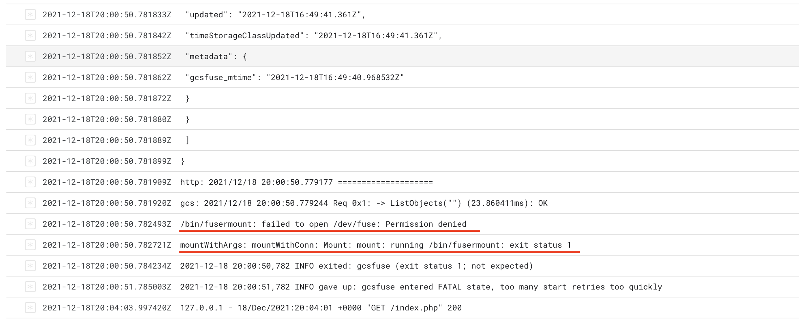

# Cloud Run Persistent Storage Issue

Stackoverflow:
https://stackoverflow.com/questions/70407189/unable-to-mount-bucket-with-gcsfuse-on-cloud-run

Cannot mount Google Cloud Storage Bucket with gcsfuse. 
```
bin/fusermount: failed to open /dev/fuse: Permission denied
mountWithArgs: mountWithConn: Mount: mount: running /bin/fusermount: exit status 1
```

## Steps to reproduce:

### Installation
https://cloud.google.com/run/docs/tutorials/network-filesystems-fuse
1. Create GCS Bucket
2. Create a Service Account that has `storage.objectAdmin` role.
3. Create Cloud Run Service
    * Second Generation
    * http/2 disabled
    * With Service Account
    * Environment variables: `DISK_BUCKET=bucket-name`
4. Setup with Cloud Build
5. Build should be successful
6. Runtime error occurs when trying execute `gcsfuse` command.



### Local testing
Locally I'm using line 1 with `--key-file` in `gcsfuse.sh` and a generated api token in `keyfile.json`. 
```
docker build -t cloud-run-persistent-storage . && docker run -p 8081:8080 cloud-run-persistent-storage
```

The issue locally is resolved with `--privileged` but this should not matter, because the [example](https://cloud.google.com/run/docs/tutorials/network-filesystems-fuse) also gets along without privileges.
```
docker build -t cloud-run-persistent-storage . && docker run --privileged -p 8081:8080 cloud-run-persistent-storage
```